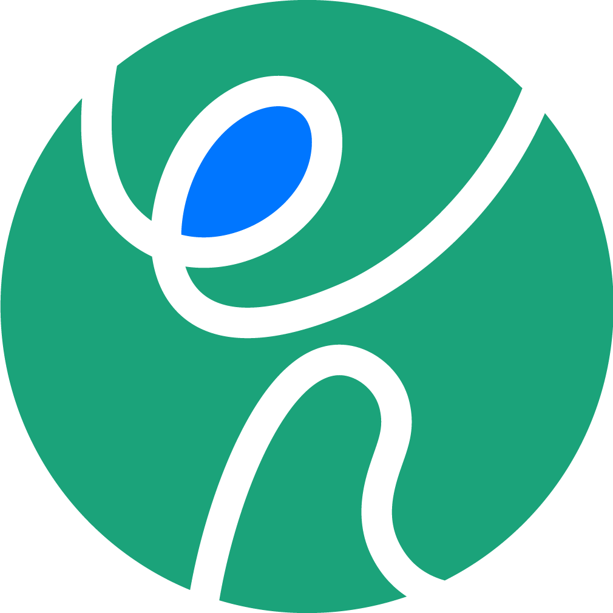
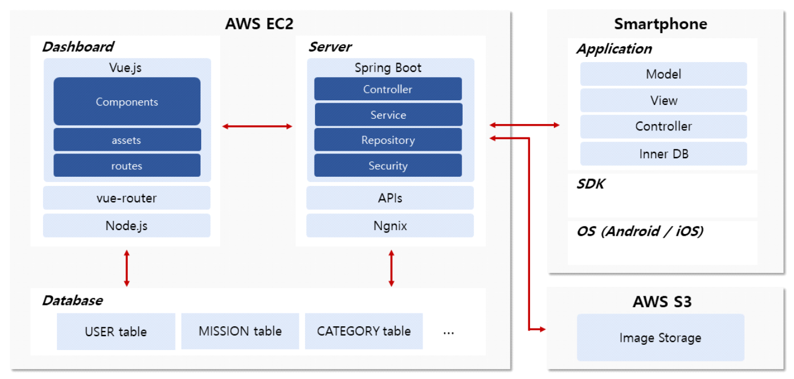

# Nolza_iOS  

### Nolza 서비스 소개  

**올림픽 관람 외의 남는 시간들을 의미있게 보낼 수 있도록, 짧은 호흡이지만 한국문화를 경험할 수 있는 컨텐츠를 제공하여 올림픽의 감동이외에도 한국에서의 특별한 경험을 선사하고자 한다.**  

평창 방문객들의 주된 목적은 올림픽 관람이다. 때문에, 방문객들의 주요 일정은 정해져 있을 것이다. 경기 이외의 시간까지 계획하기 어려울 뿐만 아니라, 촘촘하게 계획했더라도 예측 못한 일들로 인해(기상, 교통수단 놓침, 개인적인 문제 발생, 사고 등) 일정이 차질을 빚을 수 있다. 방문할 곳이 많고, 놀 수 있는 컨텐츠가 많은 서울이 아닌 강원도 평창에서 진행되기 때문에 정보가 부족하고, 즉흥적인 일정변경이 어려울 수밖에 없다. 방문객들의 남는 시간을 한국의 특성과 문화로 채워줄 수 있도록 호흡이 짧은  컨텐츠들을 제공하여, 올림픽의 감동 이외에도 한국에서의 특별한 경험을 가져갈 수 있도록 하고자 한다. 많은 여행코스를 준비했으니 능동적으로 찾아가길 바라는 사용자경험이 아닌 오후 5시 이후에 즐길 수 있는 3가지 컨텐츠를 *‘근거리 방문장소 소개(혹은 미션) → 저녁식사 → 밤 놀거리‘*라는 맥락으로 구성하여 제공한다. 뿐만 아니라 소요시간을 고려하여 틈틈이 한국문화를 경험할 수 있고, 언제든지 관심있는 컨텐츠를 선택하여 체험할 수 있도록 카테고리별 리스트를 제공한다.

***

### 개발 환경  
#### IDE - Xcode 8.2.1
#### 개발언어 - Swift 3.0

***

### System Architecture  

  

***

### 기대 효과 및 활용분야  

* 한국문화의 경험  
	* 독특하고도 새롭게 형성되고 있는 우리나라의 문화들을 즐겁게 경험 할 수 있다.  
* 올림픽을 더욱 풍요롭게  
	* 올림픽 관람일정 이외의 다른 시간을 채워주어, 한국에서의 경험을 풍요롭게 한다.  
* 컨텐츠 생산성  
	* 관광객이 체류하는 수일을 책임지는 것이 아닌, 시간 단위의 활동을 제안하는 것이기 때문에, 컨텐츠 생산에 대한 부담이 적으며, 제작시간이 짧아 트렌드 반영이 용이하다.  
* 컨텐츠 다양성  
	* 사용자(관광객)의 기호, 성향에 따라서 컨텐츠를 선택하고 경험할 수 있다.  
* 확장가능성  
	* 평창올림픽 이외에 다른 국가차원의 행사에서도 사용할 수 있는 서비스이다. 행사가 없더라도 우리나라를 방문하는 관광객들의 남은 시간을 채워줄 수 있다.  
* 기업과의 연계 용이  
	* 관광객이 필요한 시간과 원하는 컨텐츠를 선택하기 때문에 고객 니즈가 명확하여, 이를 타겟팅한 브랜드 경험 제공, 제품 홍보가 가능하다.  

***

### 발표자료  

*추후 공개 예정*  
